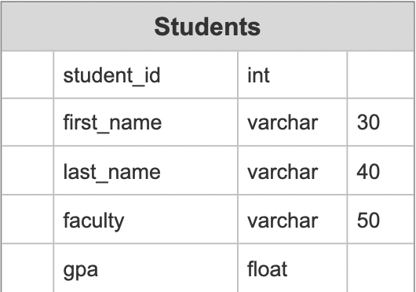

# Spring-MidtermProject

https://midtermproject-spring.herokuapp.com/

This is the project for listing students and saving information about them such as name, faculty, gpa e.t.c.

<h2>You can add a new information by using http POST method</h2>

{ 
  "first_name" : "First Name", 
  "last_name" : "Last Name", 
  "faculty" : "Faculty", 
  "gpa" : 4.0 
}

<h2>And also don't forget to add headers like this:</h2>

Content-Type : application/json

